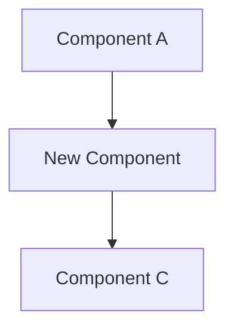

# Creating Issues/MRs in Gitlab

Use the `create-issue` bin command to create each issue. Use the Write tool to write the description to a file in the repo root (first line = title, rest = body), pass it to `create-issue`, then delete it with the Bash tool. ONLY create issues this way.

```
# 1. Use the Write tool to write to the repo root, e.g. .issue-temp.md
#    First line = issue title, remaining lines = body

# 2. Run the command (milestone is optional)
create-issue .issue-temp.md
create-issue .issue-temp.md "My Milestone Name"

# 3. Delete the temp file
rm .issue-temp.md
```

Use the exact same pattern to create an MR using `create-mr`.

## Architecture Diagrams

Every issue and MR description **must** include an architecture or flow diagram using Mermaid syntax. Choose the diagram type that best illustrates the change:

- **New feature / component** → `graph TD` or `graph LR` showing how the new piece fits into the existing system
- **Data flow / async process** → `sequenceDiagram` showing actors and message flow
- **State machine / lifecycle** → `stateDiagram-v2`
- **Database / data model** → `erDiagram`

Wrap diagrams in a fenced code block with the `mermaid` language tag:

````

````

Place the diagram in its own `## Architecture` section in the body, before the implementation details.

